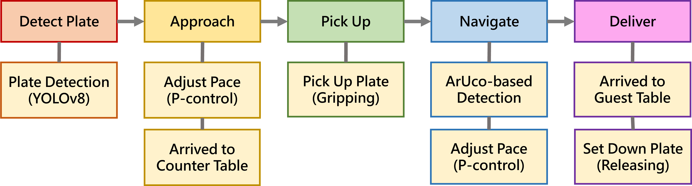

# Automated-Plate-Delivery-Machine
<!---**Current Status:** Focusing on integrating plate serving mobility.
**Future Roadmap / Challenges:** Planned implementation of LiDAR for dynamic obstacle avoidance and SLAM algorithm.
* Validated mechanical design and YOLOv8 model performance.
* Transitioned the computing core from **Raspberry Pi 4** to **NVIDIA Jetson Orin Nano** to address computational bottlenecks encountered during YOLOv8-based object detection.
* Achieved precise plate-grabbing action by implementing visual servoing algorithms, enabling the robot to autonomously align its chassis with the target using real-time YOLOv8 feedback .--->
---
## Project Demo
> **Watch the final demonstration video on YouTube:**

> **Watch the first demonstration video on YouTube:**

---
## Project Overview  

  

This project presents the design, fabrication, and implementation of an **Automated Plate Delivery Machine**. The system integrates computer vision, robotic manipulation, and mobile mobility to achieve autonomous service tasks.  
Originally developed on a Raspberry Pi 4, the computing core has been successfully migrated to the **NVIDIA Jetson Orin Nano** to overcome the latency bottlenecks and enable real-time processing for the object detection and kinematic control.  
### Funding & Recognition
* **Program:** Undergraduate Research Project
* **Grant:** Funded by the **National Science and Technology Council (NSTC)**.  
* **Institution**: Department of Electrical Engineering, National Taiwan Ocean University
* **Advisor**: Prof. Chih-Yung Cheng
* **Researcher**: Hsin-Wei Lin
---
## System Architecture
### 1. Hardware Specifications
| Component | Specification | Function |
| :--- | :--- | :--- |
| **Computing Core** | NVIDIA Jetson Orin Nano | Deep learning inference (YOLOv8) & High-level control |  
| **Vision Sensor** | USB / CSI Camera | Real-time video stream acquisition |
| **Microcontroller** | Arduino Mega 2560 | Low-level motor control & command execution |  
| **Manipulator** | Custom 2-DOF Robotic Arm | 3D printed structure designed in **SolidWorks** |  
| **Motor Driver** | L298N Module | H-Bridge driver for DC motors and arm actuation |  
| **Actuators** | DC Motors | Chassis movement control and Arm movement control |  
### 2. Software Stack
* **Language:** Python 3.9+, C++
* **Computer Vision:** OpenCV, Ultralytics YOLOv8  
* **Communication:** UART(Jetson ↔ Arduino) / I2C Protocols
* **OS:** Ubuntu 22.04  (JetPack 5.x)
---
## Engineering Techniques
### 1. Perception
### 2. Control
### 3. ArUco Marker Delivery
---
## Challenges
